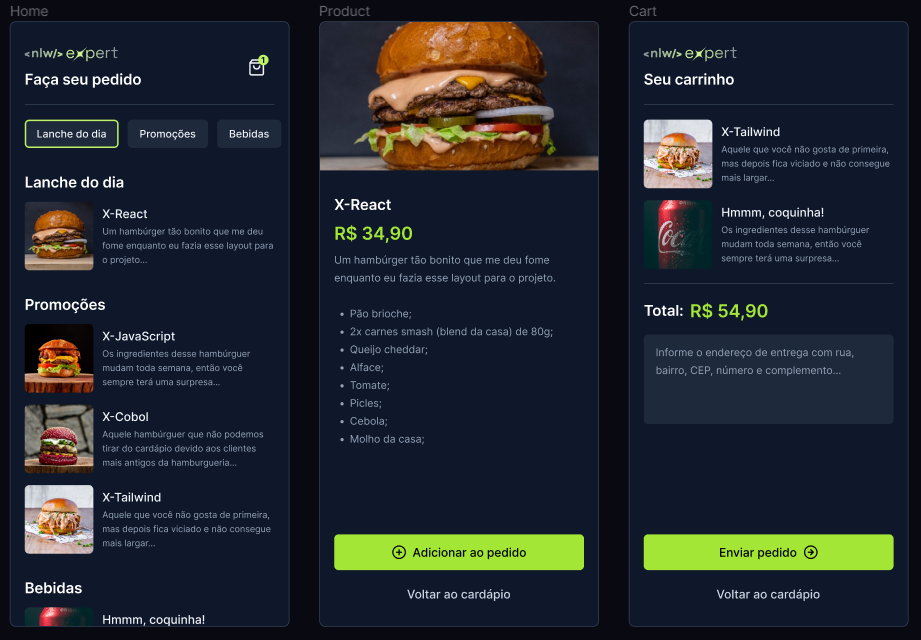

# NLW Expert Delivery APP

<image src="./assets/images/nlw_expert_Wallpaper_-_1920x1080.png" alt="nlw wallpaper" style="width: 100%; max-height: 250px;"/>

Durante a trilha de React Native da NLW Expert, desenvolvemos um aplicação de delivery, com seleção de produtos, carrinho de compras e envio de pedido ao whatsapp, utilizando tailwind, zustand e react native.



## Libs utilizadas

1. [React Native](https://reactnative.dev/docs/getting-started)
2. [Tailwindcss](https://tailwindcss.com/)
3. [Nativewind](https://www.nativewind.dev/)
4. [Zustand](https://zustand-demo.pmnd.rs/)

## Como rodar o projeto
1. Efetue o clone do projeto e acesse a pasta
1. Execute os comandos abaixo para instalar as dependências e executar o projeto

```bash
npm install
npm start
# Ou caso use yarn
yarn
yarn start
```
`OBS.: Importante adicionar um número de telefone válido no arquivo src/app/cart.tsx para que o envio para o whatsapp funcione corretamente.`
